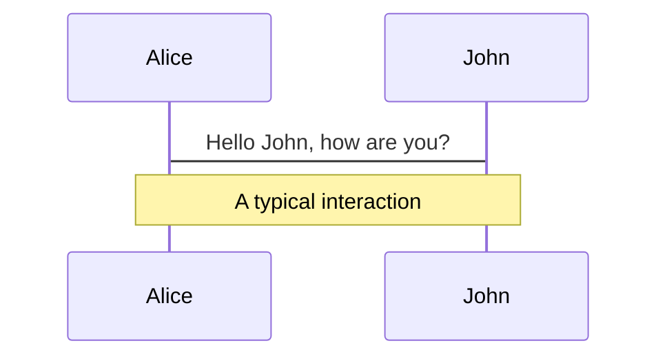
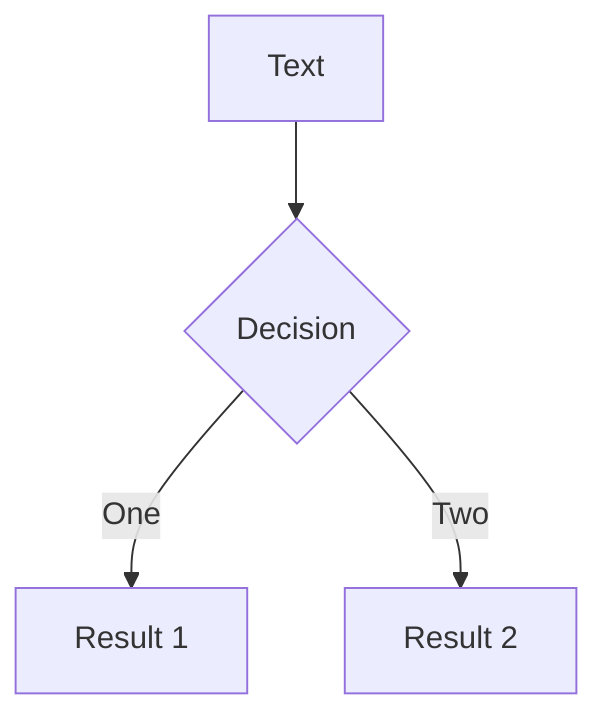
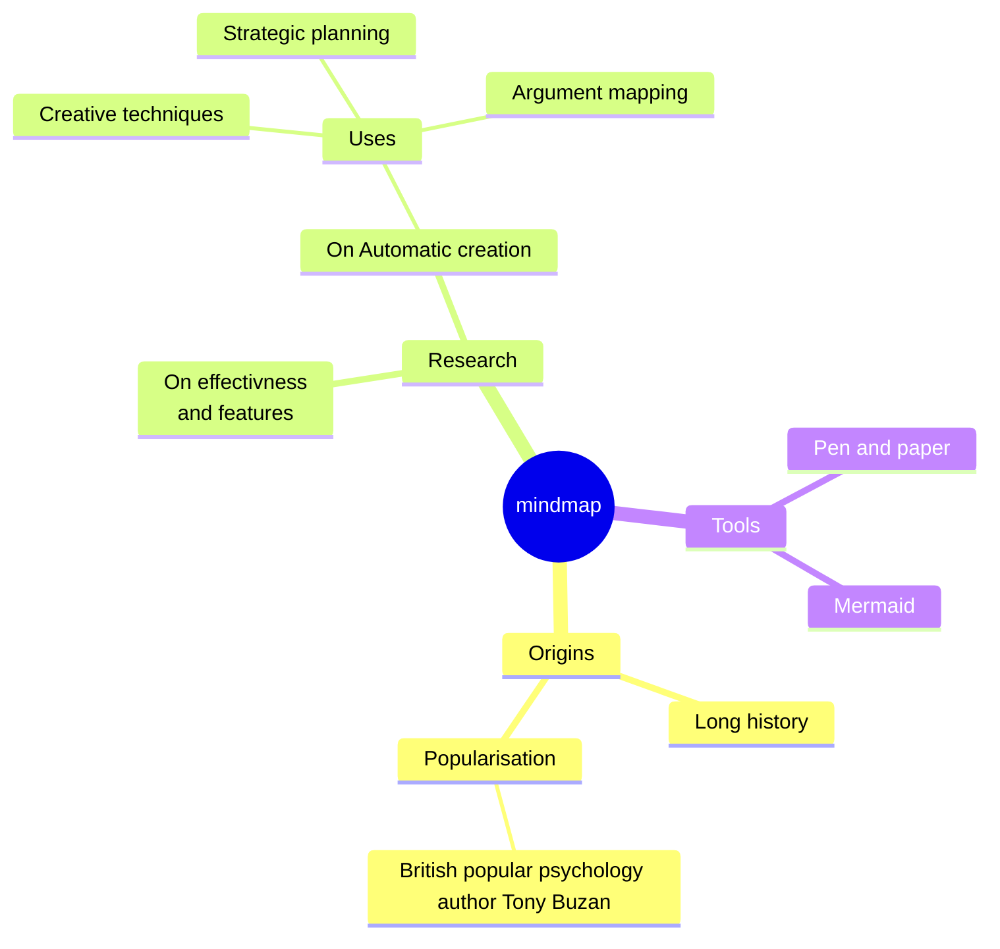
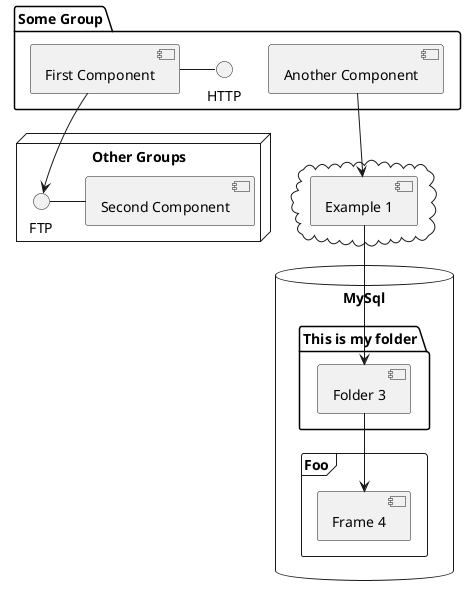

# GUPO2023年终总结


<div class="pt-12">
  <span @click="$slidev.nav.next" class="px-2 py-1 rounded cursor-pointer" hover="bg-white bg-opacity-10">
    点击开始 <carbon:arrow-right class="inline"/>
  </span>
</div>

---
layout: cover
---

# 目录

<Toc maxDepth="1"></Toc>

---
transition: slide-left
layout: cover
---

# 工作目标完成情况

2023年度

<div class="main">
  <div class="aa cursor-pointer" @click="$slidev.nav.next" hover="bg-white bg-opacity-10">
    业务方向
  </div>
  <div class="aa">
    团队方向
  </div>
</div>

<style>
.main {
  height: 400px;
  display: flex;
  flex-direction: column;
  justify-content: space-evenly;
}
.aa {
  font-size: 30px;
}
</style>

---
transition: fade-out
layout: image-right
image: '/xmtj.png'
---

# 业务方向

2023年度

<div class="aa">
在维护项目共计27个, 其中2023年新增13个, PC端/移动端各有涉猎, 业务线与中台线皆有参与。
</div>

<div class="aa">
公司项目所覆盖地区, 萧山、玉环、丽水、铜梁等地区项目皆有参与, 达成一定的覆盖率。
</div>

<style>
h1 {
  background-color: #2B90B6;
  background-image: linear-gradient(45deg, #4EC5D4 10%, #146b8c 20%);
  background-size: 100%;
  -webkit-background-clip: text;
  -moz-background-clip: text;
  -webkit-text-fill-color: transparent;
  -moz-text-fill-color: transparent;
}
.aa {
  font-size: 30px;
  margin-bottom: 15px;
}
</style>

---
transition: fade-out
layout: image-right
image: '/commit.png'
---

# 业务方向

2023年度

<div class="aa">
除在维护项目之外, 2023年度参与他人负责的项目迭代救火大于十个, 主要有移动医生、专病、丽水后台、中台新版数据格子等。
</div>

<div class="aa">

</div>

<style>
h1 {
  background-color: #2B90B6;
  background-image: linear-gradient(45deg, #4EC5D4 10%, #146b8c 20%);
  background-size: 100%;
  -webkit-background-clip: text;
  -moz-background-clip: text;
  -webkit-text-fill-color: transparent;
  -moz-text-fill-color: transparent;
}
.aa {
  font-size: 30px;
  margin-bottom: 15px;
}
</style>

---
transition: slide-up
layout: image-right
image: '/new.png'
---

# 团队方向

2023年度

<div class="aa">
  在团队内部新人文档上有7篇输出, 与张超规划设计了新人从入职到入土与公司内部各种流程的开发须知等文档。
</div>

<br/>
<br/>

[新人文档](https://release.group-ds.com/dev-newbee-handbook/pages/guide-prepare.html)

<style>
h1 {
  background-color: #2B90B6;
  background-image: linear-gradient(45deg, #4EC5D4 10%, #146b8c 20%);
  background-size: 100%;
  -webkit-background-clip: text;
  -moz-background-clip: text;
  -webkit-text-fill-color: transparent;
  -moz-text-fill-color: transparent;
}
.aa {
  font-size: 30px;
  margin-bottom: 15px;
}
</style>

---
transition: slide-up
layout: default
---

# 价值观典型事例分享

<div class="block">
  <div class="title">用户第一</div>
  用户第一对于前端而言就是UX的体现。
  在今年年初接手了多个前人遗留的旧项目, 如家庭医生、运营管理后台等, 多次重构项目内部交互相关代码, 在用户体验的优化上做到发现即改良, 并在产品部门与测试部门有相关的好评。
  在家庭医生最新的迭代中加入多个动效组件, 与建华等人分享其设计思路与方案, 并在移动医生端有实例体现。曾多次与公司UI部门人员讨论UX设计思路并且在家庭医生等多个项目中提供UX设计建议与方案。
</div>
<div class="block">
  <div class="title">创新创造</div>
  2023年相较于我个人而言主要方向还是各类移动端业务, 在移动端业务上, 封装了多个通用的移动端表单组件, 解决了移动端联动表单业务维护复杂的痛点, 并持续维护更新中, 在我负责的家庭医生端与杜晓负责的项目中皆有体现。
  <br/>
  在业务项目标准化事件中, 积极参与前期配置设计、代码开发等。
</div>
<div class="block">
  <div class="title">激情成长</div>
  今年在个人参与的开源项目上, 我负责重构了picker组件的数据绑定结构, 利用popper.js重构了menu组件的边界检测相关代码。在其他开源项目中, 有给vant提过docs与fix的pr, 也有naive的几个issue(但没有回复)。
  在业务积累上, 今年参与的项目相较去年难度增大了一些, 积累了更多公用方法与解决问题方案。
</div>
<div class="block">
  <div class="title">仁心利他</div>
  在团队内部, 利用空闲时间积极协助部门内部人员解决各类问题, 典型例子为资源管理平台monaco编辑器过大导致无法在codeup流水线打包时内存溢出问题, 经与运维部门人员讨论与探索, 最终撅腚经由前端指令强制扩大流水线中old_space空间大小为解决方案。
  在公司内部, 多次协助运维部门人员解决运维中台侧的项目中前端问题, 如Passport统一登录、Saber运维管理平台。也曾协助测试部门自动化测试事件推进时遇到的git相关问题。
</div>

<style>
h1 {
  background-color: #2B90B6;
  background-image: linear-gradient(45deg, #4EC5D4 10%, #146b8c 20%);
  background-size: 100%;
  -webkit-background-clip: text;
  -moz-background-clip: text;
  -webkit-text-fill-color: transparent;
  -moz-text-fill-color: transparent;
}
.block {
  display: flex;
  flex-direction: column;
  align-items: center;
  font-size: 14px;
}
.title {
  font-size: 16px;
  margin-bottom: 10px;
}
</style>

---
transition: slide-up
---

# 过程亮点与不足

<div grid="~ cols-2 gap-4">

  <div class="block">
    <div class="title">亮点</div>
    <div class="text"></div>
  </div>
  <div class="block">
    <div class="title">不足</div>
    <div class="text"></div>
  </div>

</div>

<style>
  h1 {
    text-align: center;
    background-color: #2B90B6;
    background-image: linear-gradient(45deg, #4EC5D4 10%, #146b8c 20%);
    background-size: 100%;
    -webkit-background-clip: text;
    -moz-background-clip: text;
    -webkit-text-fill-color: transparent;
    -moz-text-fill-color: transparent;
  }
  .block {
    font-size: 14px;
    display: flex;
    flex-direction: column;
    align-items: center;
  }
  .block .title {
    font-size: 16px;
  }
</style>

---
transition: slide-up
level: 2
---

# Navigation

Hover on the bottom-left corner to see the navigation's controls panel, [learn more](https://sli.dev/guide/navigation.html)

## Keyboard Shortcuts

|     |     |
| --- | --- |
| <kbd>right</kbd> / <kbd>space</kbd>| next animation or slide |
| <kbd>left</kbd>  / <kbd>shift</kbd><kbd>space</kbd> | previous animation or slide |
| <kbd>up</kbd> | previous slide |
| <kbd>down</kbd> | next slide |

<!-- https://sli.dev/guide/animations.html#click-animations -->

<p v-after class="absolute bottom-23 left-45 opacity-30 transform -rotate-10">Here!</p>

---
layout: image-right
image: https://source.unsplash.com/collection/94734566/1920x1080
---

# Code

Use code snippets and get the highlighting directly, and even types hover![^1]

```ts {all|5|1-6|9|all} twoslash
// TwoSlash enables TypeScript hover information and errors in markdown code blocks
// Learn more at https://www.typescriptlang.org/dev/twoslash/
function getUser(id: number): User {
  return undefined as any
}
function saveUser(id: number, user: User) {
  // ...
}
// ---cut---
interface User {
  id: number
  firstName: string
  lastName: string
  role: string
// ^?
}

function updateUser(id: number, update: User) {
  const user = getUser(id)
  const newUser = { ...user, ...update }
  saveUser(id, newUser)
}
```

<arrow v-click="[3, 4]" x1="400" y1="420" x2="230" y2="330" color="#564" width="3" arrowSize="1" />

[^1]: [Learn More](https://sli.dev/guide/syntax.html#line-highlighting)

<style>
.footnotes-sep {
  @apply mt-20 opacity-10;
}
.footnotes {
  @apply text-sm opacity-75;
}
.footnote-backref {
  display: none;
}
</style>

---

# Components

<div grid="~ cols-2 gap-4">
<div>

You can use Vue components directly inside your slides.

We have provided a few built-in components like `<Tweet/>` and `<Youtube/>` that you can use directly. And adding your custom components is also super easy.

```html
<Counter :count="10" />
```

<!-- ./components/Counter.vue -->
<Counter :count="10" m="t-4" />

Check out [the guides](https://sli.dev/builtin/components.html) for more.

</div>
<div>

```html
<Tweet id="1390115482657726468" />
```

<Tweet id="1390115482657726468" scale="0.65" />

</div>
</div>

<!--
Presenter note with **bold**, *italic*, and ~~striked~~ text.

Also, HTML elements are valid:
<div class="flex w-full">
  <span style="flex-grow: 1;">Left content</span>
  <span>Right content</span>
</div>
-->

---
class: px-20
---

# Themes

Slidev comes with powerful theming support. Themes can provide styles, layouts, components, or even configurations for tools. Switching between themes by just **one edit** in your frontmatter:

<div grid="~ cols-2 gap-2" m="t-2">

```yaml
---
theme: default
---
```

```yaml
---
theme: seriph
---
```


</div>

Read more about [How to use a theme](https://sli.dev/themes/use.html) and
check out the [Awesome Themes Gallery](https://sli.dev/themes/gallery.html).

---
preload: false
---

# Animations

Animations are powered by [@vueuse/motion](https://motion.vueuse.org/).

```html
<div
  v-motion
  :initial="{ x: -80 }"
  :enter="{ x: 0 }">
  Slidev
</div>
```

<div class="w-60 relative mt-6">
  <div class="relative w-40 h-40">
    
    
    
  </div>

  <div
    class="text-5xl absolute top-14 left-40 text-[#2B90B6] -z-1"
    v-motion
    :initial="{ x: -80, opacity: 0}"
    :enter="{ x: 0, opacity: 1, transition: { delay: 2000, duration: 1000 } }">
    Slidev
  </div>
</div>

<!-- vue script setup scripts can be directly used in markdown, and will only affects current page -->
<script setup lang="ts">
const final = {
  x: 0,
  y: 0,
  rotate: 0,
  scale: 1,
  transition: {
    type: 'spring',
    damping: 10,
    stiffness: 20,
    mass: 2
  }
}
</script>

<div
  v-motion
  :initial="{ x:35, y: 40, opacity: 0}"
  :enter="{ y: 0, opacity: 1, transition: { delay: 3500 } }">

[Learn More](https://sli.dev/guide/animations.html#motion)

</div>

---

# LaTeX

LaTeX is supported out-of-box powered by [KaTeX](https://katex.org/).

<br>

Inline $\sqrt{3x-1}+(1+x)^2$

Block
$$ {1|3|all}
\begin{array}{c}

\nabla \times \vec{\mathbf{B}} -\, \frac1c\, \frac{\partial\vec{\mathbf{E}}}{\partial t} &
= \frac{4\pi}{c}\vec{\mathbf{j}}    \nabla \cdot \vec{\mathbf{E}} & = 4 \pi \rho \\

\nabla \times \vec{\mathbf{E}}\, +\, \frac1c\, \frac{\partial\vec{\mathbf{B}}}{\partial t} & = \vec{\mathbf{0}} \\

\nabla \cdot \vec{\mathbf{B}} & = 0

\end{array}
$$

<br>

[Learn more](https://sli.dev/guide/syntax#latex)

---

# Diagrams

You can create diagrams / graphs from textual descriptions, directly in your Markdown.

<div class="grid grid-cols-4 gap-5 pt-4 -mb-6">









</div>

[Learn More](https://sli.dev/guide/syntax.html#diagrams)

---
src: ./pages/multiple-entries.md
hide: false
---

---
layout: center
class: text-center
---

# Learn More

[Documentations](https://sli.dev) · [GitHub](https://github.com/slidevjs/slidev) · [Showcases](https://sli.dev/showcases.html)
